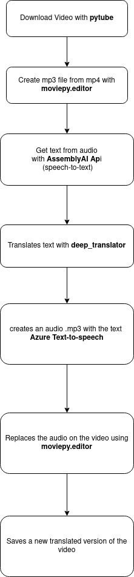

# video-translate

Have you ever thought about translate a YouTube video? That is the idea for this project. 

## How it works?

Consuming a set of python modules, a speech-to-text api from AssemblyAI and the Azure text-to-speech service, the video-translate system downloads the video with the pytube module based on its url, which must be entered by the user. 

When the download is finished, the pymovie module is called to create an .mp3 file from the downloaded .mp4. 

When the file creation is finished, the api for AssemblyAI's text-to-speech service is requested, sending the .mp3 file as data, the api returns a text containing what is said in the audio.

With the speech-to-text process finished and the AssemblyAI api returned, the Translate module is now called so that the text translation can take place with deep_translator.

With the translation of the text said in the audio finished, the Azure text-to-speech service is now called so that the translation can become an audio mp3. 

With the audio mp3 translation created, now moviepy is called again so that it can replace the original audio, with the translated audio.

**Below you can see a flowchart of how the translation is done:**
 

     

## Dependencies: 

|  **module**    | **version**  |     
|:----------:|:----------:| 
| **pytube**     | v12.1.0 | 
| **deep_translator** | v1.9.1

## API Integrations 

|  **api**    | **version**    
|:----------:|:----------:|
| **AssemblyAI**     | v2
| **Azure TTS Service** | v3
